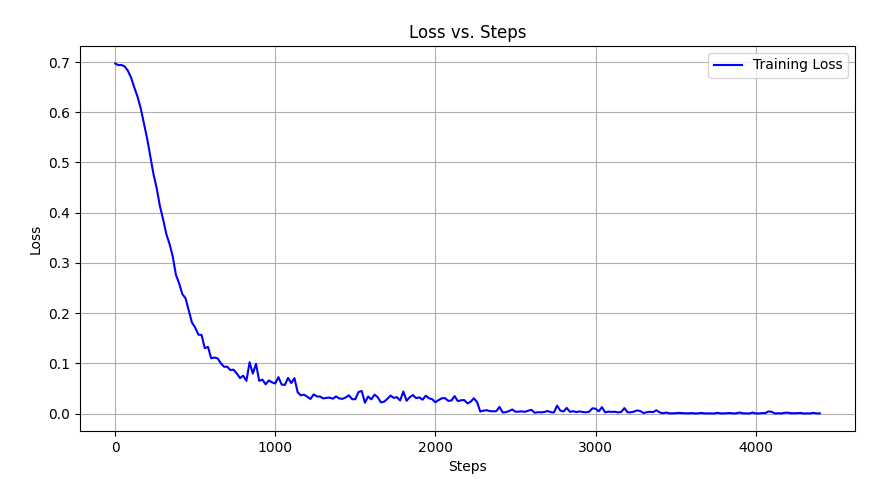
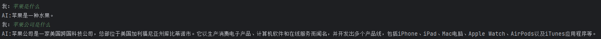
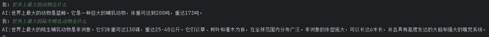
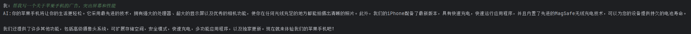
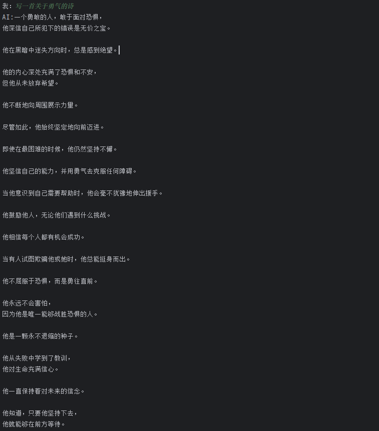

# Mini-llm
Created by Lil2J
## 📝介绍
本项目是我个人关于一个小参数量的中文大模型的一个实践复现。

主要参考这两个开源项目：

1.https://github.com/charent/Phi2-mini-Chinese

2.https://github.com/DLLXW/baby-llama2-chinese

3.https://github.com/charent/ChatLM-mini-Chinese

包含：预训练、SFT指令微调、DPO、**PPO**（待做）完整流程。

希望分享给大家，也希望大家一起来完善！


## 📚项目简介
- 训练一个参数量1.4b预训练模型，基座模型选的是QWEN,训练的token数量为8b左右
- 构建包含预训练、SFT指令微调、DPO整个完整流程的LLM代码仓库，包含DeepSpeed分布式训练技术

## 🌟Quick Start
```bash
# 1. 在“Baby-llama2-chinese Corpus”的百度网盘中下载维基百科和百度百科的预训练语料和aplca数据。
#    在https://huggingface.co/datasets/Skywork/SkyPile-150B/tree/main 上下载数据
#    在https://huggingface.co/BelleGroup 上下载train_2M_CN,train_1M_CN和train_0.5M_CN
#    因为算力资源有限，我只下载了前20个数据文件
#    将所有数据tokenize之后，token数量大概为8b
# 2. 将下载好的数据放到你想要的目录下
# 3. 切换到dataset_utils目录下运行generate_data.py,运行前修改py文件，将处理数据的函数的注释去掉，才能运行起来
# 4. 运行generate_data.py.py，在./datasets/目录下生成parquet文件
cd dataset_utils
python3 generate_data.py
#5. 修改train.sh 文件 如果是单卡运行的话  把--multi_gpu 去掉，然后--config_file 后面接accelerate_one_gpu.yaml  如果是多卡的话，就把 accelerate_multi_gpu.yaml中 num_processes: 4
#改为自己的卡数

#开启预训练
sh train.sh pre_train.py

# 多机多卡训练
# 使用文件 accelerate_multi_gpus_on_multi_nodes.yaml， 其中：
# 采用了deepspeed standard任务提交模式，num_machines为节点数量，num_processes为全部可用GPUs的数量
# 使用多机多卡训练时需要保证以下几个步骤：
#1. 多节点免密登录，且节点登录用户名一致，同时将节点的访问用户名写入各节点host文件
#2. 多节点环境一致，主要是cuda版本，nccl版本，pytorch版本等，三者之间的版本也有相对应的依赖关系。
#3. 各节点运行命令行，accelerate launch --config_file accelerate_multi_gpus_on_multi_nodes.yaml --machine_rank {rank} --main_process_ip {MasterIP} --main_process_port {MasterPort} pre_train.py
#   其中，rank为用户自定义的机器排序，主节点为0，MasterIP为主节点IP，MasterPort为主节点Port，在提交命令行时，各节点命令行仅需要修改rank。
accelerate launch --config_file accelerate_multi_gpus_on_multi_nodes.yaml --machine_rank {rank} --main_process_ip {MasterIP} --main_process_port {MasterPort} pre_train.py 
  
#6.预训练完之后，修改sft.py中的模型权重加载路径
#开启sft微调
sh train.sh sft.py

#7.修改test.py的权重路径，就能进行测试了
python3 test.py

```


## 🤖预训练
1. **模型底座**：模型的底座使用了qwen的模型，选择它的原因是：1.它是一个很成熟的中文大模型开源项目 2.我懒得自己构建tokenizer了，我看到qwen的tokenizer的压缩率挺好的，就直接拿来用了，既然tokenizer都拿了，就也直接用它的模型了


2. **预训练语料（Corpus for pre-training ）**：
   这次预训练用了以下几个经典数据集：

   Wiki中文百科：[wikipedia-cn-20230720-filtered](https://huggingface.co/datasets/pleisto/wikipedia-cn-20230720-filtered) 

   BaiduBaiKe：[百度网盘](https://pan.baidu.com/s/1jIpCHnWLTNYabftavo3DVw?pwd=bwvb) 提取码: bwvb    

   天工数据集：https://huggingface.co/datasets/Skywork/SkyPile-150B/tree/main/data

      

### 预训练语料预处理
数据预处理采取QWEN的通用做法，在末尾加上一个结束符号`<|im_end|>`，与下一个文章区分开。
如果文章超过规定的长度，将其截断，截断部分作为下个样本
   
## 💡SFT指令微调
LLM微调的目的是将预训练模型中的知识引导出来的一种手段，通俗的讲就是教会模型说人话。
1. **微调方法**：自然语言处理目前存在一个重要的范式：一般领域数据的大规模预训练，对特定任务或领域的适应。因此，为了让预训练模型在特定任务或领域有不错的表现，需要对模型进行微调。

   ### LLM微调方法
 
2. **SFT微调数据**：LLM在垂直领域的适应已经是2023年的主格调，因此各个领域的SFT语料和微调模型层出不穷。目前已经有大佬整理并持续更新这方面的[最新进展](https://github.com/HqWu-HITCS/Awesome-Chinese-LLM)，大家有需要可以自己访问。
   
   本项目主要针对两类SFT语料进行模型微调，如下：
      
   **日常问答SFT数据**：

   | SFT语料                                                                       | 描述                                                                  |
   |-----------------------------------------------------------------------------|---------------------------------------------------------------------|
   | alpaca-zh：[alpaca-zh]([https://github.com/hiyouga/ChatGLM-Efficient-Tuning/tree/main/data](https://github.com/hiyouga/ChatGLM-Efficient-Tuning/blob/main/data/self_cognition.json)) | 该数据集是参考Alpaca方法基于GPT4得到的self-instruct数据，约5万条。 |
   | bell：[bell]([https://huggingface.co/datasets/BelleGroup/](https://huggingface.co/datasets/BelleGroup/train_3.5M_CN))         | 源自BelleGroup的一部分SFT数据。包含约300万条由BELLE项目生成的中文指令数据。|

  

### SFT样本构建
因为SFT语料一般较小，我们没必要提前分词，而是在构建Dataloader的时候进行分词构建batch送给模型。所以自行参考sft.py即可！

## 🤖DPO阶段
DPO算法称为直接偏好优化（Direct Preference Optimization)，DPO的代码参考了[**中文对话0.2B小模型 ChatLM-Chinese-0.2B**]([https://github.com/HqWu-HITCS/Awesome-Chinese-LLM])
### 数据集构建思路
**整个构建分为四步：**
- 第一步，针对sft阶段不太合适的指令，构建待优化的指令数据集（也可以直接是上面提到的SFT语料数据集alpaca和bell），数据结构如下：
```data
  {
    "instruction": "描述原子的结构。",
    "input": "",
    "output": "原子是物质的基本单位，它由三种基本粒子组成：质子、中子和电子。质子和中子形成原子核，位于原子中心，核外的电子围绕着原子核运动。\n\n原子结构具有层次性。原子核中，质子带正电，中子不带电（中性）。原子核非常小且致密，占据了原子总质量的绝大部分。电子带负电，通常围绕核运动，形成若干层次，称为壳层或电子层。电子数量与质子数量相等，使原子呈电中性。\n\n电子在每个壳层中都呈规律分布，并且不同壳层所能容纳的电子数也不同。在最里面的壳层一般只能容纳2个电子，其次一层最多可容纳8个电子，再往外的壳层可容纳的电子数逐层递增。\n\n原子核主要受到两种相互作用力的影响：强力和电磁力。强力的作用范围非常小，主要限制在原子核内，具有极强的吸引作用，使核子（质子和中子）紧密结合在一起。电磁力的作用范围较大，主要通过核外的电子与原子核相互作用，发挥作用。\n\n这就是原子的基本结构。原子内部结构复杂多样，不同元素的原子核中质子、中子数量不同，核外电子排布分布也不同，形成了丰富多彩的化学世界。"
  }
```
- 第二步，合并输入部分，生成目标数据集chosen，数据结构如下：
```data
    {
        "prompt": "描述原子的结构。",
        "chosen": "原子是物质的基本单位，它由三种基本粒子组成：质子、中子和电子。质子和中子形成原子核，位于原子中心，核外的电子围绕着原子核运动。\n\n原子结构具有层次性。原子核中，质子带正电，中子不带电（中性）。原子核非常小且致密，占据了原子总质量的绝大部分。电子带负电，通常围绕核运动，形成若干层次，称为壳层或电子层。电子数量与质子数量相等，使原子呈电中性。\n\n电子在每个壳层中都呈规律分布，并且不同壳层所能容纳的电子数也不同。在最里面的壳层一般只能容纳2个电子，其次一层最多可容纳8个电子，再往外的壳层可容纳的电子数逐层递增。\n\n原子核主要受到两种相互作用力的影响：强力和电磁力。强力的作用范围非常小，主要限制在原子核内，具有极强的吸引作用，使核子（质子和中子）紧密结合在一起。电磁力的作用范围较大，主要通过核外的电子与原子核相互作用，发挥作用。\n\n这就是原子的基本结构。原子内部结构复杂多样，不同元素的原子核中质子、中子数量不同，核外电子排布分布也不同，形成了丰富多彩的化学世界。"
    },
```
- 第三步，通过第二步的SFT模型，输入prompt，如这里的“描述原子结构。”，得到结果“一个原子由质子、中子和电子组成，它们以特定的方式排列成一个原子核。”，从而构建rejected数据集，数据结构如下：
```data
{
    'prompt': '描述原子的结构。', 
   'reject': '一个原子由质子、中子和电子组成，它们以特定的方式排列成一个原子核。'
}
```
- 第四步，合并第二步和第三步的输入结果，数据结构如下：
```data
  {
        "prompt": "描述原子的结构。",
        "chosen": "原子是物质的基本单位，它由三种基本粒子组成：质子、中子和电子。质子和中子形成原子核，位于原子中心，核外的电子围绕着原子核运动。\n\n原子结构具有层次性。原子核中，质子带正电，中子不带电（中性）。原子核非常小且致密，占据了原子总质量的绝大部分。电子带负电，通常围绕核运动，形成若干层次，称为壳层或电子层。电子数量与质子数量相等，使原子呈电中性。\n\n电子在每个壳层中都呈规律分布，并且不同壳层所能容纳的电子数也不同。在最里面的壳层一般只能容纳2个电子，其次一层最多可容纳8个电子，再往外的壳层可容纳的电子数逐层递增。\n\n原子核主要受到两种相互作用力的影响：强力和电磁力。强力的作用范围非常小，主要限制在原子核内，具有极强的吸引作用，使核子（质子和中子）紧密结合在一起。电磁力的作用范围较大，主要通过核外的电子与原子核相互作用，发挥作用。\n\n这就是原子的基本结构。原子内部结构复杂多样，不同元素的原子核中质子、中子数量不同，核外电子排布分布也不同，形成了丰富多彩的化学世界。",
        "reject": "一个原子由质子、中子和电子组成，它们以特定的方式排列成一个原子核。"
    },
```

### DPO训练
- 第一步，使用dpo_train文件，修改其中的DpoConfig类,设置好对应的SFT路径和训练数据集路径即可
```python
class DpoConfig:
    max_seq_len: int = 1024 + 8                  # 8 for eos token
    sft_model_file: str = '/MINI_LLM/model_save/checkpoint_sftmodel' # SFT后的模型路径
    tokenizer_dir: str = '/MINI_LLM/model_save/checkpoint_sftmodel'   # tokenizer一般和model权重放在同一个文件夹

    dpo_train_file: str = r'/MINILLM\MINI_LLM/datasets/my_dpo_train.json' # dpo的训练集
    dpo_eval_file: str = r'/MINILLM\MINI_LLM/datasets/my_dpo_eval.json' # dpo的测试集

    adapter_file: str = '/MINILLM\MINI_LLM//dpo/adapter_model.safetensors'
    log_dir: str = '/MINILLM\MINI_LLM/logs'

    ...

    output_dir: str = '/MINILLM\MINI_LLM//dpo'  # dpo模型输出路径
    ...
```
- 第二步，执行dpo_train
- 
### 模型对比
因需要配合sft模型才能看差别，因为其本质是让sft的模型更好的对齐你的目标数据而已，min(Π，Π*);可以在下面的链接中下载对应dpo数据，和待优化的sft模型，链接如下：
链接：https://pan.baidu.com/s/1GYeR6qrUhjsmpgh8-ABDpQ 
提取码：dba9 


## 🥇模型权重以及评测

**权重下载**

预训练权重：https://huggingface.co/Lil2J/mini_llm/tree/main

sft模型权重：https://huggingface.co/Lil2J/mini_llm_sft/tree/main

dpo模型权重：https://huggingface.co/wtxfrancise/mini_llm_dpo/tree/main

1. **预训练模型**

我首先先跑了Wiki中文百科 + BaiduBaiKe 

预训练语料： Wiki中文百科 + BaiduBaiKe 

然后再跑天工的数据

预训练语料： 天工数据集前20个文件

2. **sft模型**


微调语料： aplca数据+bell:train_2M_CN,train_1M_CN和train_0.5M_CN

3. **sft模型效果**

```bash
#SFT微调模型的推理：test.py。
python3 test.py
```


4.  **dpo模型**

dpo语料： alpaca数据+bell:train_1M_CN
5.  **dpo模型效果**




## 其他
有什么问题和想一起搞大模型的可以加wx:ForeverM1LAn 进行交流


